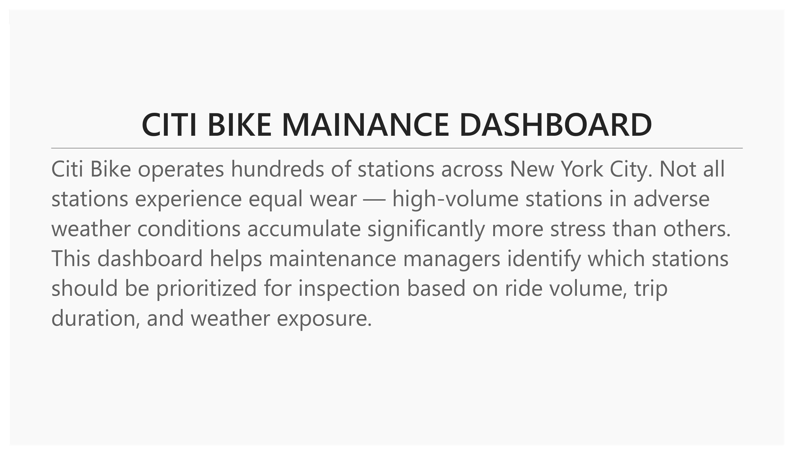
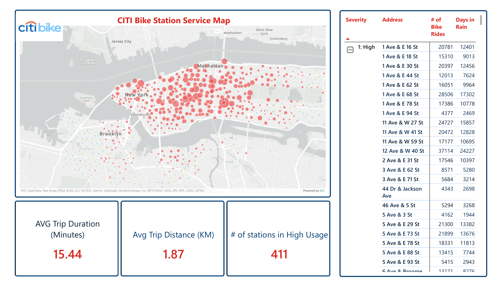

# Citi Bike Station Service Map

## [→ View live in the Power BI portfolio hub ←](https://app.powerbi.com/view?r=eyJrIjoiMTY0NWY3ZTItOTUzZi00NzIyLThhYmQtMGFmMGQzY2RhZTU4IiwidCI6IjhjZDQ5Yzc0LWNiZjctNDcyMy1hYmMzLTFhN2QzYmRjZDNhMSIsImMiOjF9)
*(opens the shared project hub — select "Citi Bike Station Service Map" from the title screen)*

## Overview

Citi Bike operates hundreds of stations across New York City. Not all stations experience equal wear — high-volume stations in adverse weather conditions accumulate significantly more stress than others. This project helps maintenance managers identify which stations should be prioritized for inspection based on ride volume, trip duration, and weather exposure.

Built on 6.45 million trips across 2016 and 2019, joined to hourly New York City weather data, and visualized in Power BI. **This project is primarily a data engineering exercise** — reconciling two mismatched source schemas, loading semi-structured weather JSON, and building a governed mart in Snowflake — with Power BI as the final consumption layer rather than the focus.





---

## Data Sources

**Citi Bike Trip Data**
- Source: Citi Bike system data (citibikenyc.com)
- Years: 2016 and 2019
- Rows: ~7.7 million trips before cleaning
- Note: 2016 and 2019 CSVs had different column ordering and naming conventions, requiring custom column mapping on load

**Weather Data**
- Source: OpenWeatherMap API, ingested via AWS S3 external stage
- Format: Raw JSON loaded into Snowflake as VARIANT, parsed on read
- Coverage: Hourly weather observations for New York City

---

## Architecture

```
Raw Ingestion (Snowflake)
    ├── BIKE16 stage → COPY INTO bikes (with column mapping for 2016 schema)
    ├── BIKE19 stage → COPY INTO bikes (2019 schema, direct load)
    └── S3 external stage → weather table (VARIANT JSON)

dbt Transformation Layer
    ├── Staging models (stg_bikes, stg_weather)
    ├── Dimension tables (dim_stations, dim_dates)
    ├── Fact table (fct_trips)
    └── Mart model (citibike_weather_mart)

Power BI Semantic Layer
    └── CITIBIKE_WEATHER_MART (single flat table, imported via CSV export)
```

---

## Snowflake Ingestion

The 2016 and 2019 Citi Bike datasets had different column ordering. The 2016 load required explicit column position mapping via `$N` syntax to reconcile the schema difference:

```sql
-- 2016 data with column remapping
COPY INTO demo.demo_schema.bikes
FROM (
    SELECT t.$12, t.$2, t.$3, t.$5, t.$4,
           t.$9, t.$8, t.$6, t.$7, t.$10, t.$11, t.$13
    FROM @DEMO.DEMO_SCHEMA.BIKE16 t
) ON_ERROR = SKIP_FILE_1;

-- 2019 data with direct column load
COPY INTO demo.demo_schema.bikes
FROM (
    SELECT s.$1, s.$2, s.$3, s.$4, s.$5, s.$6,
           s.$7, s.$8, s.$9, s.$10, s.$11, s.$12, s.$13
    FROM @DEMO.DEMO_SCHEMA.BIKE19 s
) ON_ERROR = SKIP_FILE_1;
```

---

## Mart Model

The final mart table was built in Snowflake consolidating all necessary fields for analysis:

```sql
INSERT INTO DEMO.DEMO_SCHEMA.CITIBIKE_WEATHER_MART
SELECT
    b.START_STATION_NAME,
    b.START_LAT,
    b.START_LNG,
    b.END_STATION_NAME,
    b.END_LAT,
    b.END_LNG,
    b.STARTED_AT,
    b.MEMBER_CASUAL,
    DATEDIFF('minute', b.STARTED_AT, b.ENDED_AT) AS TRIP_DURATION_MIN,
    ROUND(HAVERSINE(b.START_LAT, b.START_LNG, b.END_LAT, b.END_LNG), 2) AS TRIP_DISTANCT_KM,
    AVG(w.TEMP) AS AVG_TEMP,
    AVG(w.HUMIDITY) AS AVG_HUMIDITY,
    MIN(w.WEATHER) AS CONDITION
FROM DEMO.DEMO_SCHEMA.BIKES b
LEFT JOIN DEMO.DEMO_SCHEMA.WEATHER w
    ON TO_DATE(b.STARTED_AT) = TO_DATE(w.TIME)
WHERE b.STARTED_AT NOT IN ('starttime', 'Start Time')
  AND w.PRESSURE IS NOT NULL
GROUP BY
    b.START_STATION_NAME, b.START_LAT, b.START_LNG,
    b.END_STATION_NAME, b.END_LAT, b.END_LNG,
    b.STARTED_AT, b.MEMBER_CASUAL, b.ENDED_AT;
```

Weather records without a matching bike date are excluded. Final mart: **6.45 million rows**.

---

## DAX Measures (Power BI)

**Station Severity Rating**
```dax
Severity =
VAR StationCount =
    CALCULATE(
        COUNT('CITIBIKE_WEATHER_MART'[RIDE_ID]),
        ALLEXCEPT('CITIBIKE_WEATHER_MART',
        'CITIBIKE_WEATHER_MART'[START_STATION_NAME])
    )
RETURN
SWITCH(TRUE(),
    StationCount < 2000, "3: Low",
    StationCount < 4000, "2: Medium",
    StationCount >= 4000, "1: High"
)
```

**Rainy Days per Station**
```dax
Rainy_Days =
CALCULATE(
    DISTINCTCOUNT('CITIBIKE_WEATHER_MART'[STARTED_AT]),
    ALLEXCEPT('CITIBIKE_WEATHER_MART',
    'CITIBIKE_WEATHER_MART'[START_STATION_NAME]),
    'CITIBIKE_WEATHER_MART'[CONDITION] IN {"Rain", "Thunderstorm"}
)
```

**High Severity Station Count**
```dax
High Severity =
COUNTROWS(
    FILTER(
        DISTINCT('CITIBIKE_WEATHER_MART'[START_STATION_NAME]),
        CALCULATE(MAX('CITIBIKE_WEATHER_MART'[Severity])) = "1: High"
    )
)
```

---

## Dashboard

Built in Power BI using ArcGIS Maps for Power BI for geospatial visualization.

**Key metrics displayed:**
- 6.45M total NYC rides
- 411 high severity stations
- 15.44 min average trip duration
- 1.87 km average trip distance

**Station severity classification:**
- High (1): 4,000+ rides
- Medium (2): 2,000–3,999 rides
- Low (3): Under 2,000 rides

---

## Data Limitations

- Weather condition coverage is uneven across the date range — Rain dominates the dataset due to API sampling frequency. Clear and Fog conditions cover only single days in some cases.
- Trip distance is approximated using the Haversine formula on start/end station coordinates — actual route distance will be longer.
- No individual bike IDs are available in the source data. Analysis is at the station level, not the bike level.
- Temperature values in the source weather data are in Kelvin.

---

## Tech Stack

Snowflake · dbt · SQL (T-SQL / Snowflake SQL) · Power BI · DAX · ArcGIS Maps · Python (data generation) · GitHub
